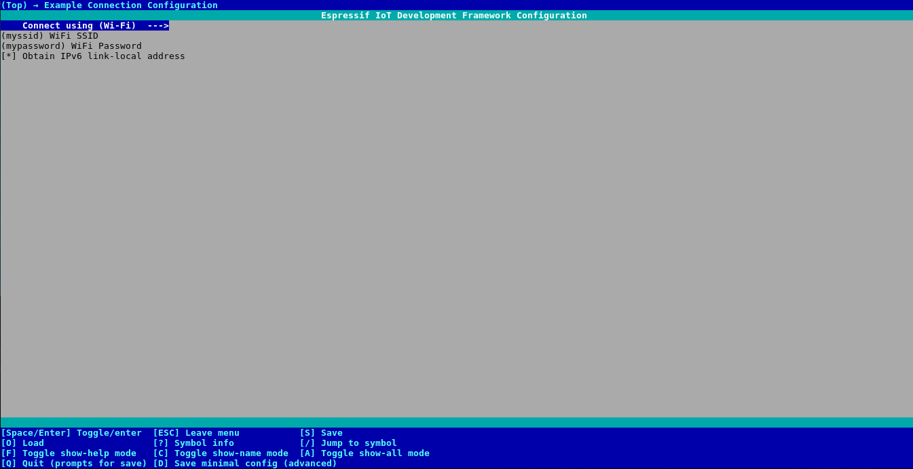
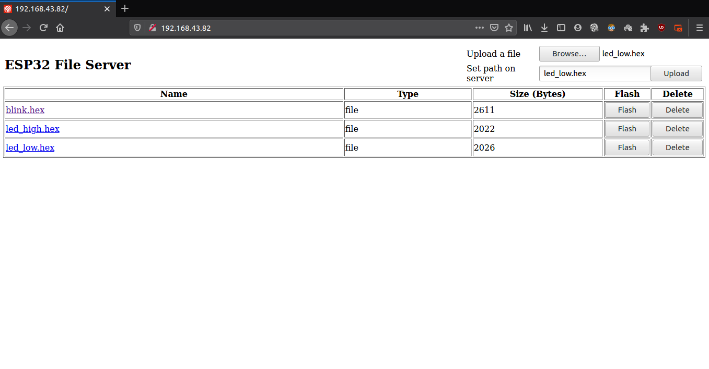

[![Stargazers][stars-shield]][stars-url]
[![Forks][forks-shield]][forks-url]
[![Issues][issues-shield]][issues-url]
[![License][license-shield]][license-url]

<!-- PROJECT LOGO -->
 

  

  <h3 align="center">OTA for AVR MCU using ESP32</h3>
  

    Program your AVR MCU Over-the-Air using ESP32
     
    
     
    <a href="https://github.com/laukik-hase/OTA_update_AVR_using_ESP32/">View Code</a>
    ·
    <a href="https://github.com/laukik-hase/OTA_update_AVR_using_ESP32/issues">Report Bug</a>
    ·
    <a href="https://github.com/laukik-hase/OTA_update_AVR_using_ESP32/issues">Request Feature</a>
    ·
    <a href="https://github.com/laukik-hase/OTA_update_AVR_using_ESP32/pulls">Create a Pull Request</a>
  

<!-- TABLE OF CONTENTS -->
## Table of Contents

- [About the Project](#about-the-project)
  - [Code](#code)
- [Getting Started](#getting-started)
  - [Hardware Required](#hardware-required)
  - [Prerequisites](#prerequisites)
  - [Setting Up](#setting-up)
- [Usage](#usage)
- [Troubleshooting](#troubleshooting)
- [Contributors](#contributors)
- [Acknowledgements](#acknowledgements)
- [License](#license)

## About the Project

The project aims at enabling firmware update of AVR-powered boards Over-the-Air using ESP32.

Testing was done with ESP32-DevKitC v4 board and Arduino UNO, Leonardo and MEGA. You can try with any other AVR-powered board and let me know how it worked out.

### Code

`/esp_avr_flash` -> Basic flashing utility, requires path of the .bin file which has been already uploaded in SPIFFS

`/file_serving_avr` -> OTA demo, with HTTP File Server with embedded flash link

`/references` -> Python scripts for understanding the flashing protocol commands and verification

## Getting Started

### Hardware Required

To run the OTA demo, you need an ESP32 dev board (e.g. ESP32-WROVER Kit) or ESP32 core board (e.g. ESP32-DevKitC). For the AVR MCU, you can use an Arduino UNO, Leonardo or MEGA.

### Prerequisites

* **ESP-IDF v4.0 and above**

  You can visit the [ESP-IDF Programmming Guide](https://docs.espressif.com/projects/esp-idf/en/latest/get-started/index.html#installation-step-by-step) for the installation steps.

* **Arduino IDE**

  Not a mandatory requirement, although it is an easy way to generate the **.hex** files for your AVR MCU code.

### Setting Up

1. Wire your AVR MCU (e.g. Arduino UNO, Leonardo, Mega, etc.) to the ESP32. All the following connections should be made through a  Bi-Directional Logic Level Converter (LLC -> 5V - 3.3V).

    |    ESP32   | LLC (L) | LLC (H) |  AVR  |
    |:----------:|:-------:|:-------:|:-----:|
    |    3.3V    |   3.3V  |    -    |   -   |
    |      -     |    -    |    5V   |   5V  |
    |     GND    |   GND   |   GND   |  GND  |
    | GPIO4 (TX) |    L1   |    H1   |   RX  |
    | GPIO5 (RX) |    L2   |    H2   |   TX  |
    |   GPIO19   |    L3   |    H3   | RESET |

2. Generate a  **.hex** file for the AVR MCU code you want to flash. You can follow this [link](https://arduino.stackexchange.com/questions/48431/how-to-get-the-firmware-hex-file-from-a-ino-file-containing-the-code/48564) for instructions.

## Usage

* Open the project configuration menu (`idf.py menuconfig`) go to `Example Connection Configuration` ->
    1. WiFi SSID: WiFi network to which your PC is also connected to.
    2. WiFi Password: WiFi password

  

    <kbd></kbd>
  

* In order to test the OTA demo -> `/file_serving_avr` :
    1. Compile and burn the firmware `idf.py -p PORT -b BAUD flash`
    2. Run `idf.py -p PORT monitor` and note down the IP assigned to your ESP module. The default port is 80.
    3. Test the example interactively on a web browser (assuming IP is 192.168.43.82):
        1. Open path `http://192.168.43.82/` to see an HTML web page with list of files on the server (initially empty)
        2. Use the file upload form on the webpage to select and upload a .hex file to the server
        3. Click a file link to download / open the file on browser (if supported)
        4. Click the delete link visible next to each file entry to delete them
        5. Click on the flash link to flash the .hex code file uploaded to the connected AVR MCU.

  

    <kbd></kbd>
  

* After clicking the flash link, you should get the following results - 

  

      
  

* Voila! Your AVR MCU is now running the code you uploaded Over-the-Air!

## Troubleshooting

* Check your wiring. Make sure that the ESP32 and AVR MCU are powered separately. Don't power one MCU using the other.
* Do not connect ESP32 pins directly to the AVR-MCU pins, as ESP32 pins are not 5V tolerant. Use a logic level convertor.
* Verify your WiFi SSID and password. It is a known bug that ESP32 does not connect to WiFi stations with 'space' character in the SSID or password.
* Check your AVR MCU code, which generated the .hex file, for any 'logical' errors.
* For any other bugs or errors, you can always raise [issues](https://github.com/laukik-hase/OTA_update_AVR_using_ESP32/issues).

## Contributors

* [**laukik-hase**](https://github.com/laukik-hase)

* [**udit7395**](https://github.com/udit7395)

**For OTA updates for STM32Fxx MCUs, you can follow this [project](https://github.com/laukik-hase/OTA_update_STM32_using_ESP32/).**

## Acknowledgements

* GitHub Project: [esp_avr_programmer](https://github.com/rene-win/esp_avr_programmer) by [rene-win](https://github.com/rene-win)

* [ESP-IDF Examples - HTTP File Server](https://github.com/espressif/esp-idf/tree/master/examples/protocols/http_server/file_serving)

* STK500 Protocol: [Documentation](http://www.amelek.gda.pl/avr/uisp/doc2525.pdf)

* [Arduino StackExchange](https://arduino.stackexchange.com/questions/61796/is-it-possible-to-upload-an-arduino-sketch-through-the-serial-port-rx-instead) answer by [Peter](https://arduino.stackexchange.com/users/39978/peter)

* [README Template](https://github.com/roshanlam/ReadMeTemplate) by [roshanlam](https://github.com/roshanlam)

## License

Distributed under the MIT License. See `LICENSE` for more information.

<!-- MARKDOWN LINKS & IMAGES -->

[forks-shield]:https://img.shields.io/github/forks/laukik-hase/OTA_update_AVR_using_ESP32
[forks-url]: https://github.com/laukik-hase/OTA_update_AVR_using_ESP32/network/members

[stars-shield]: https://img.shields.io/github/stars/laukik-hase/OTA_update_AVR_using_ESP32
[stars-url]: https://github.com/laukik-hase/OTA_update_AVR_using_ESP32/stargazers

[issues-shield]: https://img.shields.io/github/issues/laukik-hase/OTA_update_AVR_using_ESP32
[issues-url]: https://github.com/laukik-hase/OTA_update_AVR_using_ESP32/issues

[license-shield]: https://img.shields.io/github/license/laukik-hase/OTA_update_AVR_using_ESP32
[license-url]: https://github.com/laukik-hase/OTA_update_AVR_using_ESP32/blob/master/LICENSE
